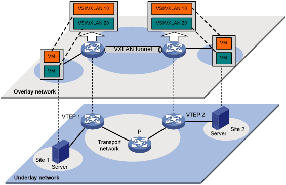

<!-- Improved compatibility of back to top link: See: https://github.com/othneildrew/Best-README-Template/pull/73 -->

<!-- PROJECT LOGO -->
 

<h3 align="center">Bgp At Door of Autonomous System is Simple !</h3>

  

  

### Contributors
#### Hina Razanamasy and Alice Lin

<!-- ABOUT THE PROJECT -->
## About The Project
   	Le projet à pour but de nous faire découvrir les VxLANS.
	Nous avons créé et configuré des topologies de VxLANS sur GNS3 

(<a href="#readme-top">back to top</a>)

### Technologies used

* GNS3
* Docker
* Wireshark

(<a href="#readme-top">back to top</a>)

<!-- GETTING STARTED -->
## Address learning BGP EVPN
We use control plane learning
In BGP EVPN, VTEPs exchange MAC-to-VTEP mappings directly using BGP messages. When a VTEP learns a new MAC address, it advertises the mapping along with the associated VXLAN Network Identifier (VNI) to other VTEPs in the network. This creates a distributed control plane, allowing all VTEPs to learn about each other's MAC-to-VTEP mappings without the need for an external router.

It's better than using Data plane learning as we don't need to flood all machines. So if a BUM traffic arrives, the VTEP just have to send it to the right multicast group.

“Control plane learning means that switches learn MAC addresses before there’re needed !
This work the same way as a routing protocol : switched peer with each other using BGP, and share the addresses that they know about → this uses EVPN address family“
Address families : they are ways for BGP to carry reachability information for different protocols.
Each switch runs BGP.
BGP make the Vteps to learn each other and include informations of each VTEPS : the MAC address associated with them thanks to GARP message : 

The main purpose of GARP messages is to update or announce information about the device to other devices on the same network segment : MAC address updates

## Why do we need OSPF ? 
The OSPF is used for the underlay routing protocol in an EVPN IBGP deployment. It is used to provide IP-based connectivity between the leaf-switch, which allows them to exchange BGP EVPN routes containing information about the MAC and IP addresses associated with the customerVLANs that are being transported over the EVPN overlay network.

## VTEP and encapsulation
When a traffic comes from an host to the switch, the switch-leaf add VxLAN header wich contain the VNI.

## Unerdlay and Overlay 

## What is GNS3 ? 
GNS3 consists of two software components:

The GNS3-all-in-one software (GUI) : client interface to set up and see the device’s architecture
The GNS3 virtual machine (VM) : where to run the typologies

- Typologies : devices architecture setup

- So, When you create topologies in GNS3 using the all-in-one software GUI client, the devices created need to be hosted and run by a server process. You have a few options for the server part of the software:

- Local GNS3 server
- Local GNS3 VM
- Remote GNS3 VM

### Prerequisites

- You have to have GNS3 installed on your environment
- You have to have Wireshark or any packet analyzer installed
- You have to pull the busybox official image from busybox
- You have to create the image fr/routing from the Dockerfile present in P1

<!-- USAGE EXAMPLES -->
## Usage

On part 2 and 3 : 

- 1) Import your topology in GNS3
- 2) Execute the start routeur and start host scripts
- 3) Start all the devices on GNS3, ping the machines then check if the packet is send with Wireshark

(<a href="#readme-top">back to top</a>)

<!-- ACKNOWLEDGMENTS -->
## Acknowledgments

*  VxLANS
*  BGP EVPN OSPF Protocols
*  General networking

(<a href="#readme-top">back to top</a>)

